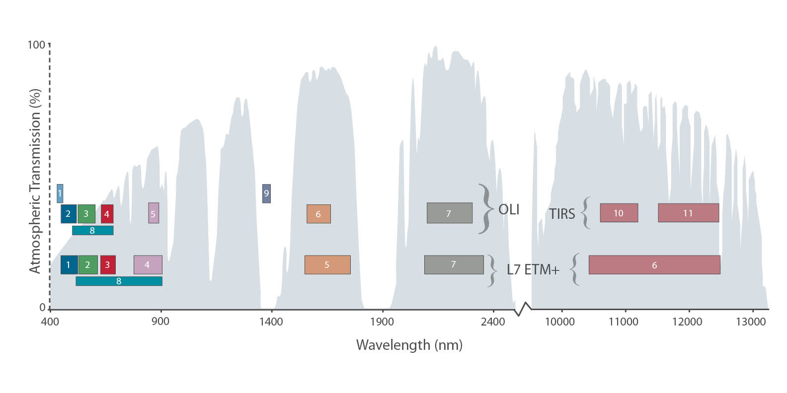
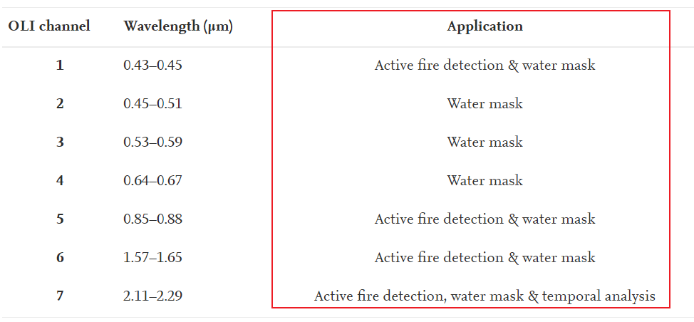
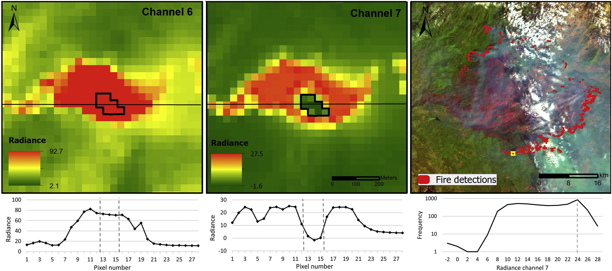

# What is Landsat 8?

.pull-left[

* a US satellite launched in February 11, 2013

* has two senors:
  * Operational Land Imager (OLI)
  * Thermal Infrared Sensor (TIRS)
  
* orbit: polar, sun-synchronous

* altitude: 705 km

* managed by NASA and the US Geological Survey (USGS)

* to collect imagery used for observing and managing the Earth’s resources

]

.pull-right[

```{r echo=FALSE, out.width='100%'}
knitr::include_graphics("image/lansat.jpg")
```
.small[Landsat 8 Spacecraft. Source: [Landsat Science](https://landsat.gsfc.nasa.gov/satellites/landsat-8/spacecraft-instruments/landsat-8-spacecraft/)
] 
]
---
## Spatial resolution
.pull-left[

* OLI are 15 meters and 30 meters 

* TIRS are 100 meters
]
.pull-right[
```{r  echo=FALSE, out.width='90%', fig.align='center'}
knitr::include_graphics("image/spatial.png")
```
.small[
Source: [(Byoungchul et al., 2015)](https://www.researchgate.net/publication/279283935_Classification_of_Potential_Water_Bodies_Using_Landsat_8_OLI_and_a_Combination_of_Two_Boosted_Random_Forest_Classifiers)
] 
]
## Radiometric resolution
* 12-bit scaled to 16-bit integers

* 4096 possible values to 32,767 possible values


---
## Spectral resolution 
* OLI with 9 bands, and TIRS with 2 bands.
```{r echo=FALSE, out.width='70%'}

```
.small[Source: [Landsat Science](https://landsat.gsfc.nasa.gov/satellites/landsat-8/spacecraft-instruments/landsat-8-spacecraft/)
] 

## Temporal resolution

* 16 days

---
# Case study: active fire detection
.pull-left[
* Applied algorithms on OLI data of Landsat 8

* Improved small fire detection and large wildfire delineation

* Reduced error rate in daytime and night
]
.pull-right[
```{r  echo=FALSE, out.width='120%', fig.align='center'}

```
]

```{r  echo=FALSE, out.width='75%', fig.align='center'}

```

.small[Source: [(Wilfrid et al., 2016)](https://www.sciencedirect.com/science/article/pii/S0034425715301206)]

---
# Case study: water use mapping in the Colorado River Basin

* Mapping evapotranspiration by using Landsat data in spatial resolution with 100 meters
* Found croplands is the largest consumer of managed surface and ground water and shrublands
is the largest consumer of natural rainfall and soil moisture
* Further studies can be identified and recorded water footprints of different fields using historical Landsat data

```{r  echo=FALSE, out.width='55%', fig.align='center'}
knitr::include_graphics("image/water.jpg")
```

.small[Source: [(Gabriel et al., 2016)](https://www.sciencedirect.com/science/article/pii/S0034425715302650)]

---
# Case study: spruce beetles epidemic in southern Colorado
.pull-left[
* Evaluated the severity (0 - 100% dead) of mortality for forests

* Displayed the distribution of spruce beetles outbreaks

* Potential efficient monitoring of spruce beetles outbreaks by using Landsat
]
.pull-right[

```{r  echo=FALSE, out.width='65%'}

```

.small[Source: [(Brian et al., 2018)](https://www.mdpi.com/1999-4907/9/6/336)]
]

---
# Reflection on Landsat 8 data 
* Landsat 8 has OLI sensor and TIRS sensor, including 11 bands, and the applications of them are useful:

  * band 1 (OLI) for coastal studies
  * band 2 (OLI) for distinguishing deciduous from coniferous vegetation
  * band 4 (OLI) for identifying vegetation slopes
  * band 9 (OLI) for detection of cirrus
  * band 10 and 11 (TIRS) for thermal mapping
  
* Landsat data can be used through temporal aspect.

 * analyzing the dynamics of canopy cover between 1990 and 2020.
 
* Landsat data can be utilized in machine learning techniques such as deep learning for image classification, object detection and etc.

---
# Reflection on how to use it in my work
* The thermal data will be a good source for me to explore the temperature variables in my study, like exploring the thermal inequality in different race groups. 

* The visualization of data are informative for me to find some potential trends, like potential direction of development for urban area.

* The data also can be a applied in some further studies that are related to forest management, climate change, agriculture and natural resources management, and etc. 

---
# Reference
* Ko, B., Kim, H. and Nam, J. (2015). ‘Classification of Potential Water Bodies Using Landsat 8 OLI and a Combination of Two Boosted Random Forest Classifiers’. Sensors, 15, pp. 13763–13777. doi: 10.3390/s150613763.

* Schroeder, W., Oliva, P., Giglio, L., Quayle, B., Lorenz, E. and Morelli, F. (2016). ‘Active fire detection using Landsat-8/OLI data’. Remote Sensing of Environment. (Landsat 8 Science Results), 185, pp. 210–220. doi: 10.1016/j.rse.2015.08.032.

* Senay, G. B., Friedrichs, M., Singh, R. K. and Velpuri, N. M. (2016). ‘Evaluating Landsat 8 evapotranspiration for water use mapping in the Colorado River Basin’. Remote Sensing of Environment. (Landsat 8 Science Results), 185, pp. 171–185. doi: 10.1016/j.rse.2015.12.043.

* Woodward, B. D., Evangelista, P. H. and Vorster, A. G. (2018). ‘Mapping Progression and Severity of a Southern Colorado Spruce Beetle Outbreak Using Calibrated Image Composites’. Forests. Multidisciplinary Digital Publishing Institute, 9 (6), p. 336. doi: 10.3390/f9060336.


