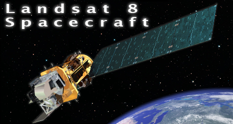
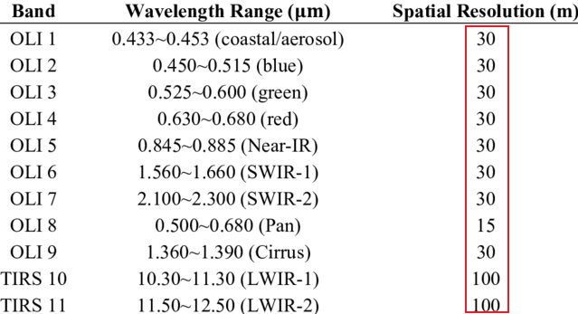
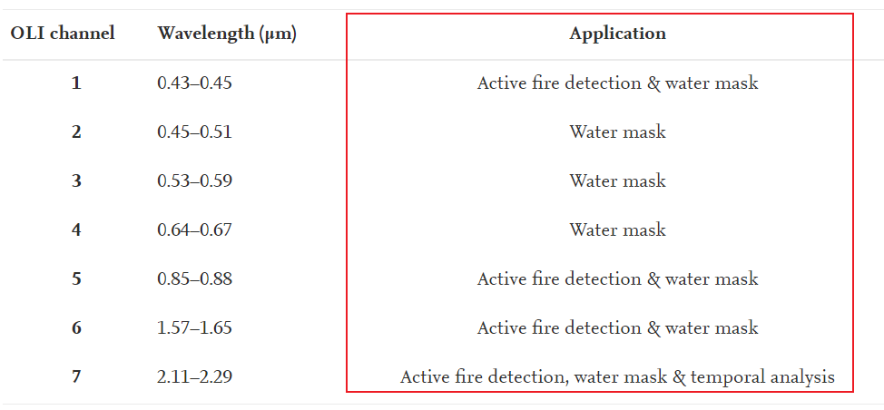
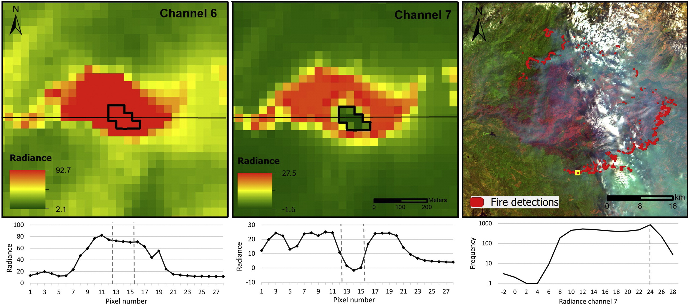
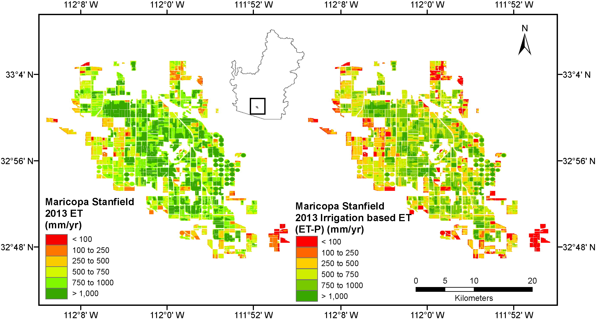

# What is Landsat 8?

.pull-left[

* a US satellite launched in February 11, 2013

* has two senors:
  * Operational Land Imager (OLI)
  * Thermal Infrared Sensor (TIRS)
  
* orbit: polar, sun-synchronous

* altitude: 705 km

* managed by NASA and the US Geological Survey (USGS)

* to collect imagery used for observing and managing the Earth’s resources

]

.pull-right[

```{r echo=FALSE, out.width='100%'}

```
.small[Landsat 8 Spacecraft. Source: [Landsat Science](https://landsat.gsfc.nasa.gov/satellites/landsat-8/spacecraft-instruments/landsat-8-spacecraft/)
] 
]
---
## Spatial resolution
.pull-left[

* OLI are 15 meters and 30 meters 

* TIRS are 100 meters
]
.pull-right[
```{r  echo=FALSE, out.width='90%', fig.align='center'}

```
.small[
Source: [(Byoungchul et al., 2015)](https://www.researchgate.net/publication/279283935_Classification_of_Potential_Water_Bodies_Using_Landsat_8_OLI_and_a_Combination_of_Two_Boosted_Random_Forest_Classifiers)
] 
]
# Radiometric resolution
* 12-bit scaled to 16-bit integers

* 4096 possible values to 32,767 possible values


---
## Spectral resolution 

```{r echo=FALSE, out.width='80%'}
knitr::include_graphics("image/Spectral_resolution.jpg")
```
.small[Source: [Landsat Science](https://landsat.gsfc.nasa.gov/satellites/landsat-8/spacecraft-instruments/landsat-8-spacecraft/)
] 

# Temporal resolution

* 16 days

---
#Application  

1. Monitoring urban growth and sprawl 

2. Monitoring land cover/land use change 

3. Assessing water resources  

4. Assisting in disaster relief and management 

5. Observing crop health and yield 

6. Detecting coastal change 

7. Mapping ecosystems 

8. Monitoring snow and ice 

9. Observing global climate change

---
# Case study: active fire detection
.pull-left[
* Applied algorithms on OLI data of Landsat 8

* Improved small fire detection and large wildfire delineation

* Reduced error rate in daytime and night
]
.pull-right[
```{r  echo=FALSE, out.width='120%', fig.align='center'}

```
]

```{r  echo=FALSE, out.width='75%', fig.align='center'}

```

.small[Source: [(Wilfrid et al., 2016)](https://www.sciencedirect.com/science/article/pii/S0034425715301206)]

---
# Case study: water use mapping in the Colorado River Basin
* Mapping evapotranspiration by using Landsat data in spatial resolution with 100 meters
* Found croplands is the largest consumer of managed surface and ground water and shrublands
is the largest consumer of natural rainfall and soil moisture
* Further studies can be identified and recorded water footprints of different fields using historical Landsat data

```{r  echo=FALSE, out.width='55%', fig.align='center'}

```

.small[Source: [(Gabriel et al., 2016)](https://www.sciencedirect.com/science/article/pii/S0034425715302650)]

---
# Reflection


